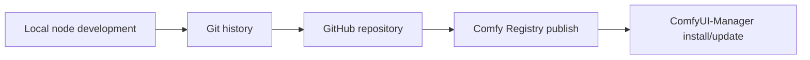

# Dustin ComfyUI Nodes

A starter ComfyUI custom node pack for collecting your own reusable nodes and
publishing them through GitHub, Comfy Registry, and ComfyUI-Manager.

I wrote some of these nodes for my own workflows first, then organized them into
this reusable package.

## What this repository is

In ComfyUI, a custom node pack is a Python package placed inside
`ComfyUI/custom_nodes`. When ComfyUI starts, it loads packages that export
`NODE_CLASS_MAPPINGS`.

This repository is set up to teach and support the full lifecycle:



## Current nodes

### Dustin Text Prefix

Category: `Dustin Nodes/Text`

Inputs:

- `text`: source text.
- `prefix`: text added before the source.
- `separator`: text inserted between `prefix` and `text`.

Output:

- `text`: combined string.

This first node is intentionally small so you can verify repository structure,
loading behavior, and publishing flow before adding more advanced nodes.

### Dustin Image Atlas

Category: `Dustin Nodes/Image`

Inputs:

- `images`: a batch of square images.
- `max_width`: maximum atlas width in pixels.
- `max_height`: maximum atlas height in pixels.
- `padding`: empty pixels inserted between tiles.

Outputs:

- `atlas_image`: one stitched atlas image.
- `atlas_metadata`: JSON text containing each tile's index and position.

Behavior:

- Places images from left to right.
- Wraps to a new row when the next image would exceed `max_width`.
- Raises an error instead of resizing or dropping images when the atlas would exceed `max_height`.

### Dustin Marble Generate World

Category: `Dustin Nodes/Marble`

Calls the [World Labs Marble API](https://docs.worldlabs.ai/api) to generate a 3D world,
then polls until the long-running operation completes (typically about 5 minutes).

Authentication:

- Set `api_key` on the node, or
- Set the `WLT_API_KEY` environment variable before starting ComfyUI.

Inputs:

- `prompt_type`:
  - `text`: text-to-world (`text_prompt` required).
  - `image_url`: image-to-world from a public URL (`image_url` required).
  - `image_tensor`: image-to-world from a ComfyUI `IMAGE` input (`image` required).
  - `multi_image_json`: multi-image from a JSON array (`multi_image_json` or builder node output).
  - `video_url`: video-to-world from a public URL (`video_url` required).
  - `video_file`: local video file (`video_path` or `media_asset_id` required).
- `text_prompt`: text guidance (required for `text`; optional for other modes).
- `model`: `marble-1.1`, `marble-1.1-plus`, `marble-1.0`, or `marble-1.0-draft`.
- `display_name`: optional world name (max 64 characters).
- `seed`: random seed (`-1` omits seed from the request).
- `is_pano`: mark the input image as a panorama (image modes only).
- `reconstruct_images`: multi-image reconstruction mode (up to 8 images).
- `disable_recaption`: send `text_prompt` as-is without automatic recaptioning.
- `poll_interval_seconds` / `max_wait_seconds`: operation polling controls.

Outputs:

- `world_json`: full world payload from the completed operation.
- `world_id`: generated world ID.
- `marble_url`: link to open the world in Marble.
- `asset_urls_json`: thumbnail, panorama, mesh, and Gaussian splat download URLs.

Recommended image formats for URL / tensor modes: `jpg`, `jpeg`, `png`, `webp`.
Recommended video formats: `mp4`, `mov`, `mkv`.

### Dustin Marble Build Multi-Image Prompt

Category: `Dustin Nodes/Marble`

Uploads an `IMAGE` batch and builds `multi_image_json` for the generate node.

Inputs:

- `images`: square scene photos as an image batch.
- `azimuths`: comma-separated degrees, one per image (example: `0,90,180,270`).
- `upload_mode`: `media_asset` (recommended) or `data_base64`.

Output:

- `multi_image_json`: JSON array for `Dustin Marble Generate World` (`prompt_type = multi_image_json`).

### Dustin Marble Generate Multi-Image World

Category: `Dustin Nodes/Marble`

All-in-one multi-image generation: uploads batch images, starts generation, polls until done.

### Dustin Marble Upload Video

Category: `Dustin Nodes/Marble`

Uploads a local video via Marble `media-assets:prepare_upload` and returns `media_asset_id`.

Inputs:

- `video_path`: absolute or relative path to `mp4`, `mov`, `mkv`, etc.

### Dustin Marble Generate Video World

Category: `Dustin Nodes/Marble`

Video-to-world generation from either a public `video_url` or a local file / uploaded `media_asset_id`.

### Dustin Marble Preview Thumbnail

Category: `Dustin Nodes/Marble`

Downloads the world thumbnail and shows it in the ComfyUI preview panel.

Inputs (either one):

- `asset_urls_json` from a generate node, or
- `image_url` with a direct thumbnail URL.

Outputs:

- `image`: ComfyUI `IMAGE` tensor for downstream nodes.

### Dustin Marble Preview Panorama

Category: `Dustin Nodes/Marble`

Downloads the world panorama (`pano_url`) and shows it in the ComfyUI preview panel as a flat image.

Inputs (either one):

- `asset_urls_json` from a generate node, or
- `image_url` with a direct panorama URL.

Outputs:

- `image`: ComfyUI `IMAGE` tensor (panoramas can be very wide).

### Dustin Marble Pano 360 Viewer

Category: `Dustin Nodes/Marble`

Interactive **equirectangular** panorama viewer embedded in the node. After you queue the workflow,
drag inside the node to look around and use the mouse wheel to zoom (similar to a 360° web viewer).

Uses a DOM widget with an embedded viewer page (`js/pano_embed.html`) so pointer events are not
stolen by the workflow canvas (works in both Node 1.0 and Node 2.0 UIs). Pannellum is bundled under
`js/vendor/pannellum/` (no CDN).

Recommended workflow:

```text
Dustin Marble Generate World → asset_urls_json → Dustin Marble Pano 360 Viewer
```

Inputs (at least one):

- `asset_urls_json` from a generate node (uses `pano_url`),
- `image_url` with a direct panorama URL, or
- `image` from an upstream `IMAGE` output.

Options:

- `max_preview_width`: downscales very large panoramas before preview (default `4096`) to avoid WebGL limits.

Outputs:

- `image`: ComfyUI `IMAGE` tensor for downstream nodes (Save Image, etc.).

Notes:

- Panoramas are downloaded on the server first (avoids CORS issues with Marble CDN URLs).
- Use **Preview Panorama** for a quick flat preview; use **Pano 360 Viewer** for interactive look-around.

### Dustin Image Atlas Extract

Category: `Dustin Nodes/Image`

Inputs:

- `atlas_image`: the stitched atlas image from `Dustin Image Atlas`.
- `atlas_metadata`: JSON metadata from `Dustin Image Atlas`.
- `index`: the tile number to extract, starting from `0`.

Output:

- `image`: the cropped tile for the selected index.

## Local installation

Copy or clone this repository into your `ComfyUI/custom_nodes` folder:

```powershell
cd path\to\ComfyUI\custom_nodes
git clone https://github.com/YOUR_GITHUB_USERNAME/dustin-comfyui-nodes.git
```

Then restart ComfyUI and search for `Dustin` to find all nodes in this pack.

## Repository layout

- `__init__.py`: ComfyUI package entry point.
- `nodes/`: node implementations and exports.
- `pyproject.toml`: Comfy Registry metadata.
- `requirements.txt`: runtime Python dependencies.
- `docs/full-flow.zh-CN.md`: step-by-step Chinese guide for Git, GitHub, publishing, and updates.

## Publishing outline

ComfyUI-Manager now uses Comfy Registry as the main distribution path.

1. Create a GitHub repository.
2. Push this code to GitHub.
3. Create a publisher on [registry.comfy.org](https://registry.comfy.org/).
4. Generate a Registry API key.
5. Fill in the real repository URL and `PublisherId` in `pyproject.toml`.
6. Run `comfy node publish`.

Once a version is published, it cannot be edited. You must bump the version and
publish again for every fix or new node.

## Versioning

This project uses semantic versioning:

- `PATCH`, for example `0.1.1`: bug fix or documentation fix.
- `MINOR`, for example `0.2.0`: new node or backward-compatible feature.
- `MAJOR`, for example `1.0.0`: breaking change.

## Adding a new node later

1. Create a new node class inside `nodes/`.
2. Export it from `nodes/__init__.py`.
3. Add it to `NODE_CLASS_MAPPINGS` and `NODE_DISPLAY_NAME_MAPPINGS`.
4. Document it here.
5. Test it locally in ComfyUI.
6. Bump `version` in `pyproject.toml`.
7. Push and publish the new version.

## Notes

Most nodes use only the Python standard library. The Marble node also requires
`requests` (see `requirements.txt`).
