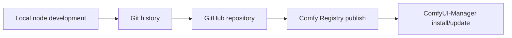

# Dustin ComfyUI Nodes

A starter ComfyUI custom node pack for collecting your own reusable nodes and
publishing them through GitHub, Comfy Registry, and ComfyUI-Manager.

## What this repository is

In ComfyUI, a custom node pack is a Python package placed inside
`ComfyUI/custom_nodes`. When ComfyUI starts, it loads packages that export
`NODE_CLASS_MAPPINGS`.

This repository is set up to teach and support the full lifecycle:



## Current nodes

### Dustin Text Prefix

Category: `Dustin Nodes/Text`

Inputs:

- `text`: source text.
- `prefix`: text added before the source.
- `separator`: text inserted between `prefix` and `text`.

Output:

- `text`: combined string.

This first node is intentionally small so you can verify repository structure,
loading behavior, and publishing flow before adding more advanced nodes.

### Dustin Image Atlas

Category: `Dustin Nodes/Image`

Inputs:

- `images`: a batch of square images.
- `max_width`: maximum atlas width in pixels.
- `max_height`: maximum atlas height in pixels.
- `padding`: empty pixels inserted between tiles.

Outputs:

- `atlas_image`: one stitched atlas image.
- `atlas_metadata`: JSON text containing each tile's index and position.

Behavior:

- Places images from left to right.
- Wraps to a new row when the next image would exceed `max_width`.
- Raises an error instead of resizing or dropping images when the atlas would exceed `max_height`.

### Dustin Image Atlas Extract

Category: `Dustin Nodes/Image`

Inputs:

- `atlas_image`: the stitched atlas image from `Dustin Image Atlas`.
- `atlas_metadata`: JSON metadata from `Dustin Image Atlas`.
- `index`: the tile number to extract, starting from `0`.

Output:

- `image`: the cropped tile for the selected index.

## Local installation

Copy or clone this repository into your `ComfyUI/custom_nodes` folder:

```powershell
cd path\to\ComfyUI\custom_nodes
git clone https://github.com/YOUR_GITHUB_USERNAME/dustin-comfyui-nodes.git
```

Then restart ComfyUI and search for `Dustin Text Prefix`, `Dustin Image Atlas`,
or `Dustin Image Atlas Extract`.

## Repository layout

- `__init__.py`: ComfyUI package entry point.
- `nodes/`: node implementations and exports.
- `pyproject.toml`: Comfy Registry metadata.
- `requirements.txt`: runtime Python dependencies.
- `docs/full-flow.zh-CN.md`: step-by-step Chinese guide for Git, GitHub, publishing, and updates.

## Publishing outline

ComfyUI-Manager now uses Comfy Registry as the main distribution path.

1. Create a GitHub repository.
2. Push this code to GitHub.
3. Create a publisher on [registry.comfy.org](https://registry.comfy.org/).
4. Generate a Registry API key.
5. Fill in the real repository URL and `PublisherId` in `pyproject.toml`.
6. Run `comfy node publish`.

Once a version is published, it cannot be edited. You must bump the version and
publish again for every fix or new node.

## Versioning

This project uses semantic versioning:

- `PATCH`, for example `0.1.1`: bug fix or documentation fix.
- `MINOR`, for example `0.2.0`: new node or backward-compatible feature.
- `MAJOR`, for example `1.0.0`: breaking change.

## Adding a new node later

1. Create a new node class inside `nodes/`.
2. Export it from `nodes/__init__.py`.
3. Add it to `NODE_CLASS_MAPPINGS` and `NODE_DISPLAY_NAME_MAPPINGS`.
4. Document it here.
5. Test it locally in ComfyUI.
6. Bump `version` in `pyproject.toml`.
7. Push and publish the new version.

## Notes

This starter node uses only the Python standard library.
